[![Forks][forks-shield]][forks-url]
[![Stargazers][stars-shield]][stars-url]
[![Issues][issues-shield]][issues-url]
[![LinkedIn][linkedin-shield]][linkedin-url]


<p>

<h1 align="center">Git</h1>
</p>

# Table of Content


  - [Some Problems](#some-problems)
  - [What is VCS](#what-is-vcs)
  - [Advantages](#advantages)
  - [VCS Types](#vcs-types)
    - [CVCS](#cvcs)
    - [DVCS](#dvcs)
  - [Github](#github)
    - [Github VS Git](#github-vs-git)
    - [Fork](#fork)
    - [Star](#star)
    - [Gist](#gist)
    - [Pull Request](#pull-request)
    - [Issues](#issues)
    - [README](#readme)
  - [.gitignore](#gitignore)
  - [Git Life cycle](#git-life-cycle)
  - [Git commands](#git-commands)
    - [config](#config)
    - [initialize](#initialize)
    - [adding to stage](#adding-to-stage)
    - [status](#status)
    - [commit](#commit)
    - [Showing differences](#showing-differences)
    - [showing log](#showing-log)
    - [Restting](#restting)
      - [Unstaging](#unstaging)
      - [Commit reset](#commit-reset)
      - [Discarding Changes from working area](#discarding-changes-from-working-area)
    - [Remote](#remote)
    - [Push](#push)
    - [Pull](#pull)
    - [Clone](#clone)
  - [Branches](#branches)
    - [Branch usage](#branch-usage)
    - [commands](#commands)
      - [Creating Branch](#creating-branch)
      - [Showing all Branches](#showing-all-branches)
      - [Changing between branches](#changing-between-branches)
      - [Deleting Branch](#deleting-branch)
  - [Merge](#merge)
    - [command](#command)
  - [Resolving Conflicts](#resolving-conflicts)
  - [Rebase](#rebase)
  - [Other](#other)
    - [git configuration in jetbrains IDE](#git-configuration-in-jetbrains-ide)
    - [Export as PDF](#export-as-pdf)
  - [Other Resources](#other-resources)
- [Contact](#contact)

## Some Problems 
👨‍🦯


- Have you ever tried to return to previous versions in your projects?
- Have you ever lost your code?
- Have you shared your code with others?
- Have you felt the need of reviewing the history of the project?


<p align="center">
</img>
</p>


## What is VCS 

  In software engineering, version control is a class of systems responsible for managing changes to computer programs, documents, large web sites, or other collections of information. Version control is a component of software configuration management.

## Advantages of VCS 

By answering the questions mentioned above, the advantages of VCS are mentioned.

<p align="center">
</img>
</p>


## VCS Types
### CVCS
<p align="center">
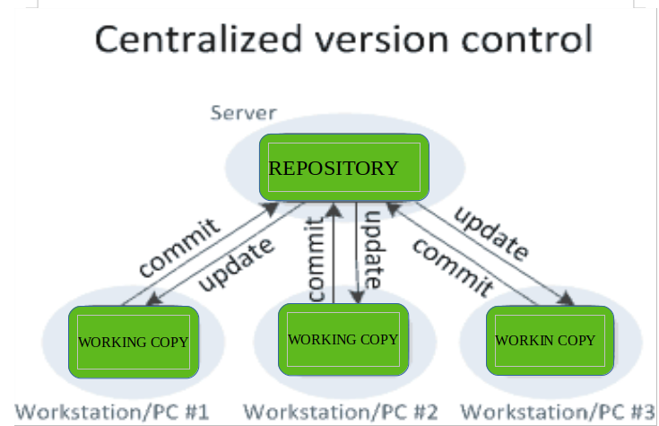
<br>
<strong>Centrialiazed version control system</strong>
</p>

### DVCS

<p align="center">
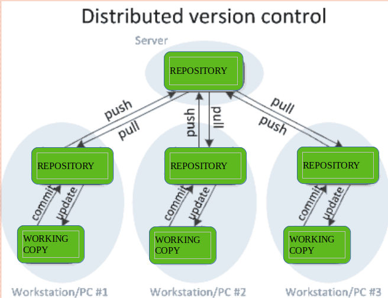
<br>
<strong>Centrialiazed version control system</strong>
</p>

## Github
GitHub is a provider of Internet hosting for software development and version control using Git. It offers the distributed version control and source code management functionality of Git, plus its own features.

<p align="center">
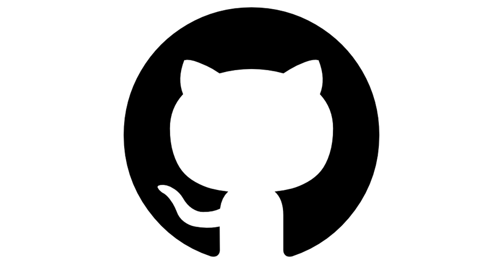</img>
</p>

**Github is instagram for gits.**
It's where people share the source code of their projects.

### Github VS Git

<p align="center">
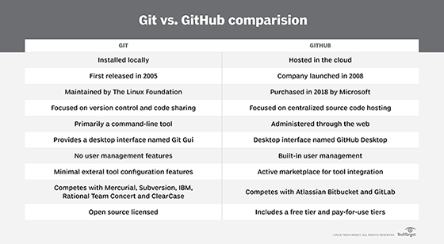</img>
</p>

### Fork

After using GitHub by yourself for a while, you may find yourself wanting to contribute to someone else's project. Or maybe you'd like to use someone's project as the starting point for your own. This process is known as forking. Creating a “fork” is producing a personal copy of someone else's project.

<p align="center">
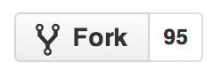</img>
</p>

### Star

It's exactly like **like** in instagram or **fave** in Twitter.

<p align="center">
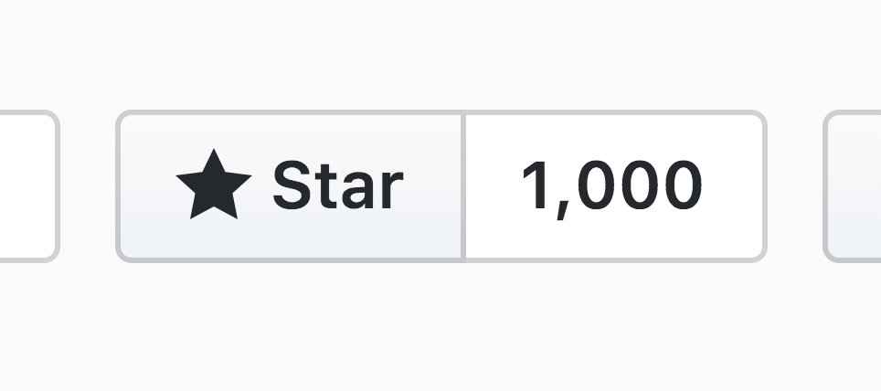</img>
</p>

### Gist

Gist is an easy method to share snippets or excerpts of data with others. A gist can be a string of code, a bash script or some other small piece of data. These bits of information are hosted by GitHub as a repository. 

<p align="center">
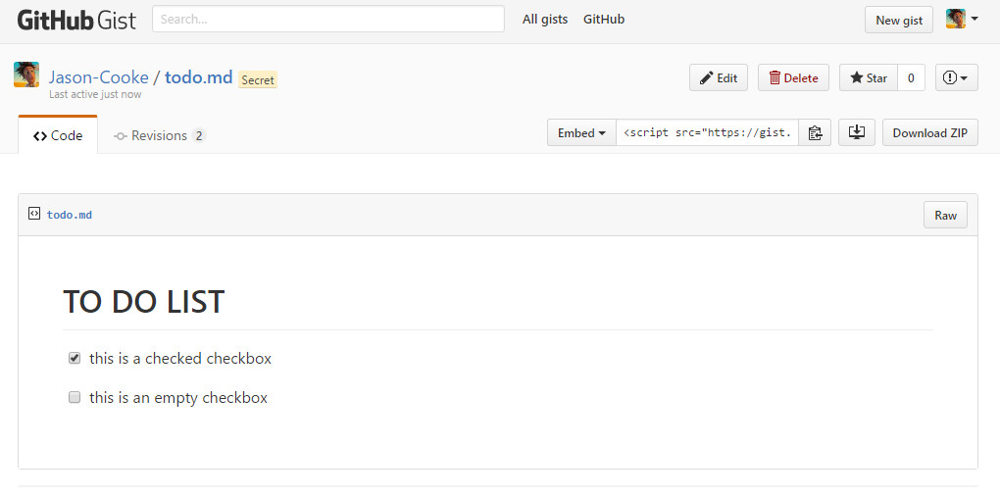</img>
</p>

### Pull Request
Pull requests let you tell others about changes you've pushed to a branch in a repository on GitHub. Once a pull request is opened, you can discuss and review the potential changes with collaborators and add follow-up commits before your changes are merged into the base branch.

<p align="center">
</img>
</p>

### Issues
projects. They’re kind of like email, except they can be shared and discussed with the rest of your team.

<p align="center">
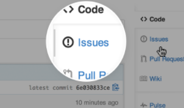</img>
</p>

### README

README is a markdown file in which you can describle your project and mention how it runs. It is written in **markdown**
language. For more information about markdown, follow [this link](https://guides.github.com/features/mastering-markdown/).

## .gitignore
There are some files or directories that there is no need to be tracked by git.
Files such as ```.class``` are unncessary files which may cause some problems after being fetched.

```bash
touch .gitignore
```
This will create a .gitignore file for you. In this file, you write files or directories that you don't want to be tracked by git.

<p align="center">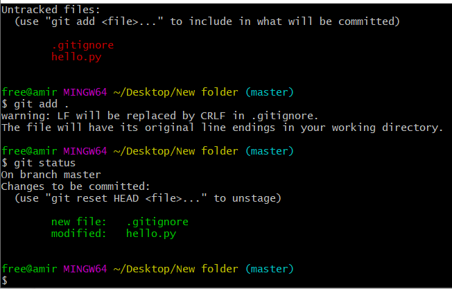
<p align="center">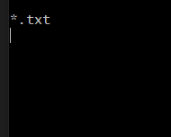
<p align="center">gitignore file content</p>

<hr>

## Git Life Cycle

<p align="center">
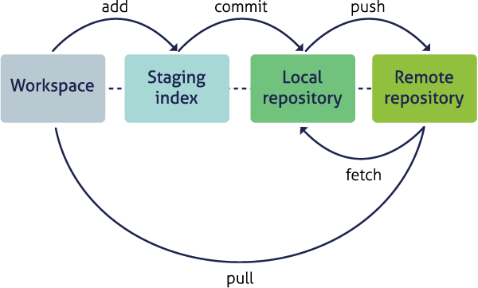</img>
</p>

## Git commands 
😎
### config name and email

```bash
git config --global user.name "your name"
git config --global user.email "your email"
```

This will save your name and email and will be shown in your commit history.

<hr>

### initialize 
🏃‍♀️

```bash
git init
```
This command initializes an empty repository. It's the first step to create a repository.

<hr>

### adding to stage 
➕
```bash
git add <filename>
```
- In case you want to add all of the files to the stage area, you should use one of the commands below.
  
```bash
git add -A
git add .
```

<hr>

### status 
❔

```bash
git status
```
By this command, we understand the conditions of the files. For instance, if we had used ```git add -A``` before, the files are shown in <span style="color:green">green</span> color in terminal, otherwise they are shown in <span style="color:red">red</span>.

<hr>


### commit 

```bash
git commit -m "commit message"
```
By using this command, all of the changes are saved in repository. After using this command, use ```git status``` and you'll see that the phrase below will be shown.

<p align="center">
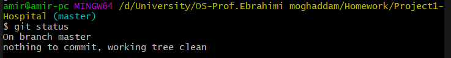
<caption><u>nothing to commit, working tree clean</u></caption>
</imge>
</p>


There is one other command you can use. The command below will both add and commit, but you must pay attention that you can only use it when you have added your files to the stage area at least once.

```bash
git commit -a -m "commit message"
```

<hr>

### Showing differences 
🤛🤜

```bash
git diff
```
This will show the differences between **now** and the **last time adding to the stage area**. 

<hr>

### showing log

```bash
git log
```
This will show you the history of commits in reversal order. Some fields such as name, email, and the commit IDs will be shown. By using ```git log --oneline```, you can see history of commits in line. For instance, the command ```git log -2``` will show you the last 2 commits.

<hr>

### Restting
#### Unstaging

```bash
git rm --cached <filename>
```
This command will remove your file from stage area.(Unstaging the file)

```bash
git rm --cached -r .
```
This will remove all files from stage area.

**Note**: If you use the second command, you won't be able to use ```git commit -a -m "commit message"```, because the files are removed from stage area.


```bash
git reset HEAD -- <filename>
```
You have entered stage area, but you want to remove your changes there.

**Note**: Although you will quit from stage area, but you still can use ```git commit -a -m "commit message"```.

<p align="center"> 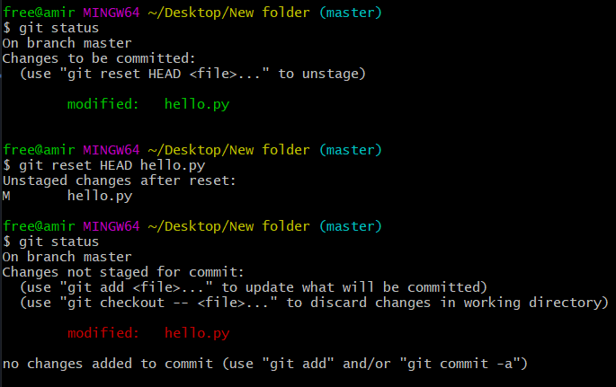


#### Commit reset
In this state, you want to return to a specific commit. It is called reset commit. For this, you have to know the ID of that commit.

```bash
git reset --hard <commit id>
```
For getting commit IDs, you should use ```git log```.

<p align="center"> 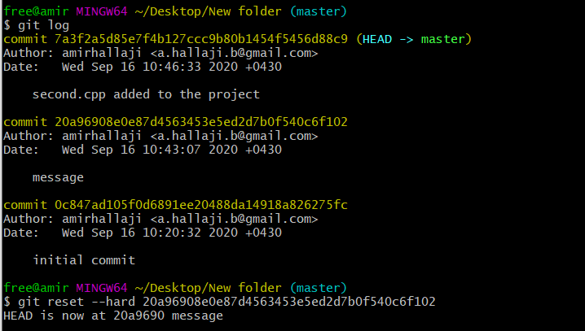

#### Discarding Changes from working area

```bash
git checkout -- <filename>

git restore <filename>
```
By using one of these two commands, you discard changes from working area.
It might happen that you want to return to your previous state. In this state, you haven't entered stage area and had commited that file before at least once.
In case you want to extend it to all files, use ```.``` instead of file name.
It acts like ```ctrl + z```.


<hr>

### Remote
```bash
git remote add origin <repository link>
```
Use this command if you want to remote to your project in github or gitlab.

<hr>

### Push
```bash
git push origin master
```
This will upload your project to your github/gitlab repository.

<hr>

### Pull
```bash
git pull origin master
```
This will fetch the latest updates made by your collaborators or in other ways.

<hr>

### Clone
```
git clone <repository link>
```
This will download the repository from the link given. (<strong>.git</strong> folder will be in the file.)

<hr>

## Branches

The default branch is master. You can create different branches in your project to use them.

<p align="center"></p>


### Branch usage
Suppose you're woking on the project and have developed different versions of that. You have to keep each version seperate from others. Beacuse we have learnt git by now, we keep different versions in different branches. Now we can keep the first version of the project and start to develop the next versions.

<p align="center">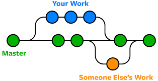</p>


### Branch commands

#### Creating Branch

```bash
git branch <name>
```
The command above will create a branch named **name**.


#### Showing all Branches

```bash
git branch -a
```
This will show you the list of all branches.


#### Changing between branches

```bash
git checkout <name>
```
By using this command, you will switch from the current branch to the **name** branch.


#### Deleting Branch

```bash
git branch -d <name>
```
This will delete the **name** branch.

<hr>

## Merge
Suppose you and your friend are developing an application. You do the back-end and your friend do the front-end. At last, These two should be merged.

### command
```bash
git merge <name>
```
Suppose you want to merge branch **name** with **master**. Use this command in master branch. After using this command, you have to do a merge commit.
## Resolving Conflicts

Some conflicts may occur when you remote to your server and you won't be able to push. So first you must fetch tha latest update, merge the conflicts and then push your commit.

<hr>

## Rebase

**Rebase** and **Merge** are both ways for integrating changes from one branch to another. But, they do it differently.

- When you use ```git merge master``` in Feature branch, you create a new commit *merge commit* in **Feature** branch which preserves only the last commit of **master** branch.
  
  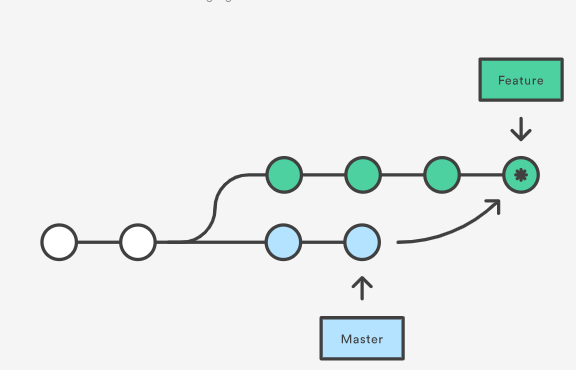


- But when you do rebasing, it is different. If you rebase the *Feature* branch on to *master* branch using ```git rebase master``` in **Feature** branch, it moves the entire *Feature* branch to begin on the tip of the *master* branch. Rebasing re-writes the project history by creating brand new commits for each commit in the original branch.

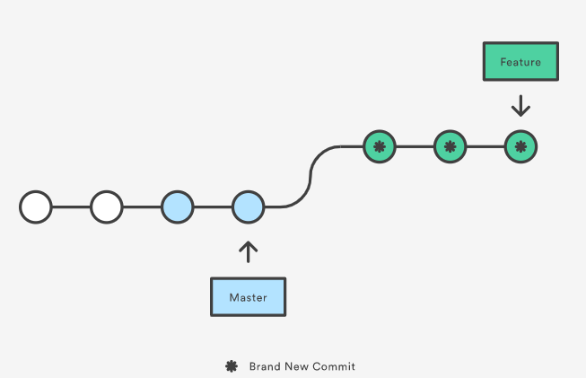

<hr>

## Other

### git configuration in Jetbrains IDE

<p align="center">
</img>
</p>


You can use git as a GUI application, although I recommend you to use commands instead, but this would not be so bad if you learn how to work with. 

You should follow these steps.

<ol>
<li>
Click on <strong>VCS</strong>
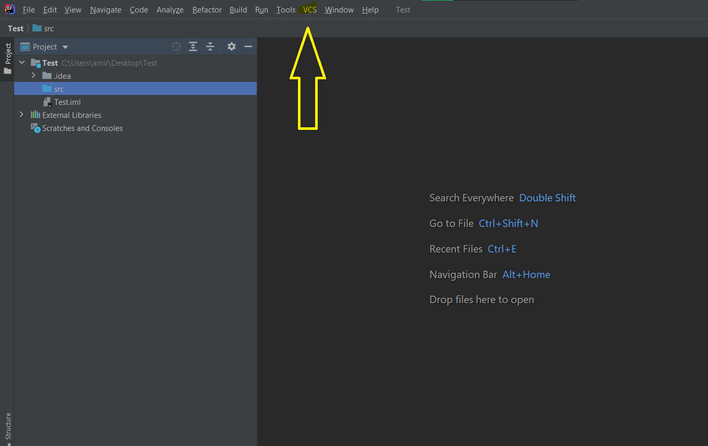</img>
</li>

<li>
Then click on <strong>Enable version control Integeration and choose <u>Git</u>.</strong>
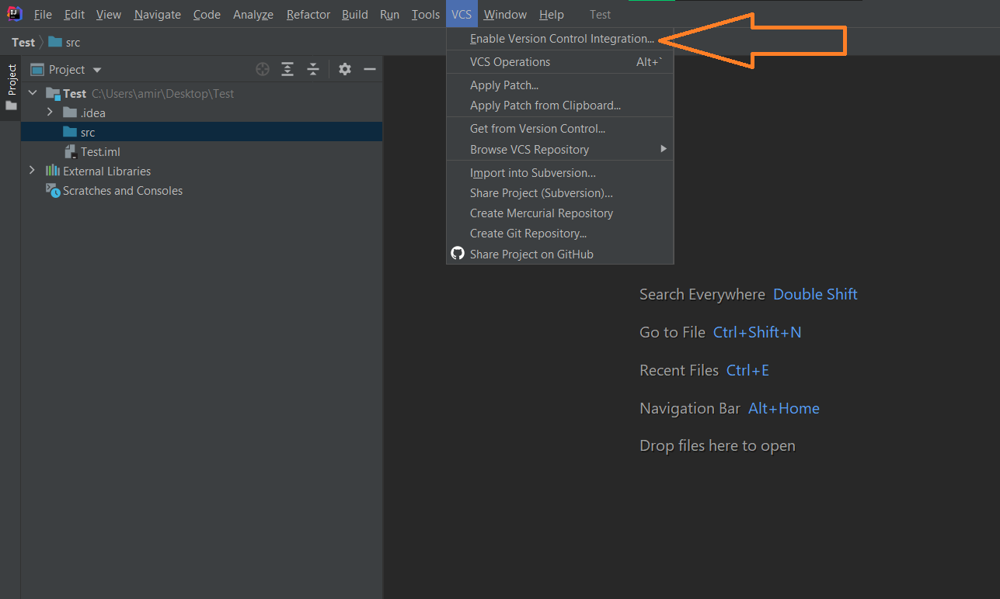</img>
</li>

<li>
In case you want to <strong>Commit, Push or Pull</strong>, do as it's shown below.
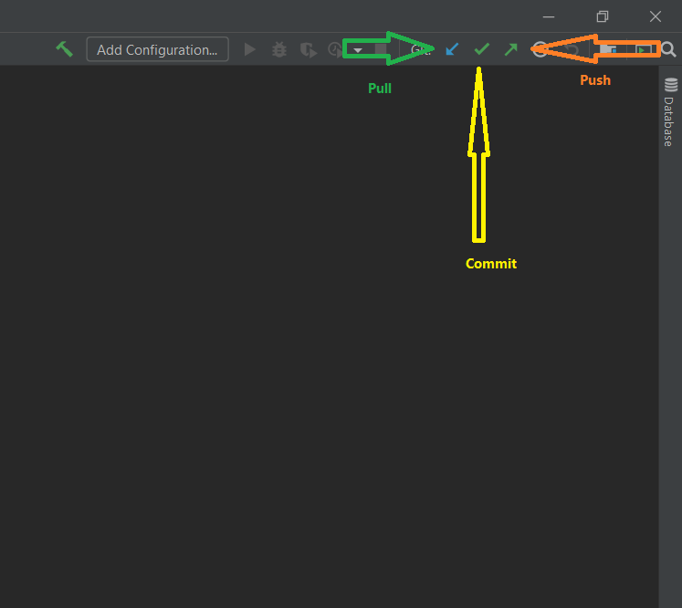</img>
</li>

</ol>

- In case you want to get a project from version control, you should do this👇 and then paste the repository link in repository URL.

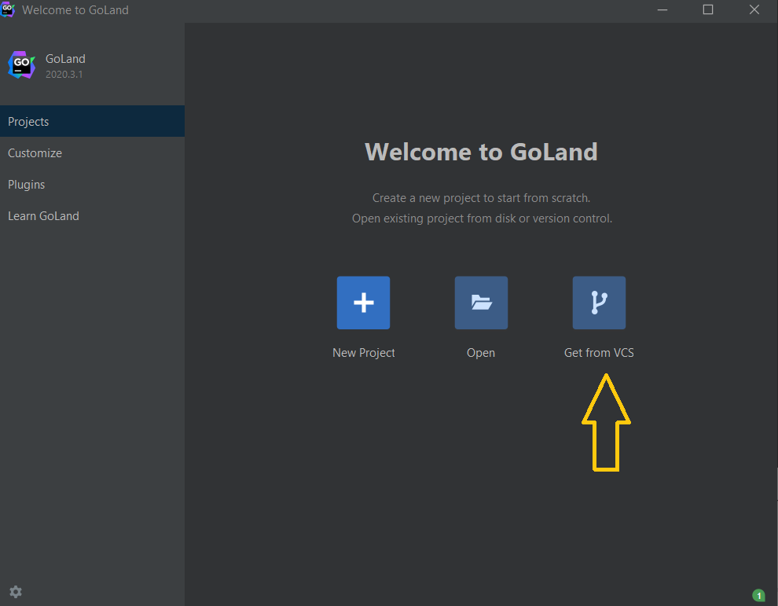</img>

<hr>

### Export as PDF

Use this command to export this markdown file as a PDF file.

```bash
pandoc README.md -t beamer -o panc.pdf --pdf-engine=xelatex
```

<hr>

## Other Resources

- [Roozbe Sharifnasab's slide](https://github.com/rsharifnasab/my-learning/tree/master/git)
- [Parsa Hejabi's slide](http://slides.com/parsahejabi/git#/1)
- [Git workflow-Atlassian Tutorial](https://www.atlassian.com/git/tutorials/comparing-workflows/gitflow-workflow)
- [Git Explorer](https://gitexplorer.com/)
- [Jadi Mirmirani's Videos](https://faradars.org/courses/fvgit9609-git-github-gitlab)
- [Git-scm](https://git-scm.com/)
  
## Contact

<a href="mailto:a.hallaji.b@gmail.com">
</img></a>

<a href="mailto:a.hallaji.b@gmail.com">
</img></a>


[forks-shield]: https://img.shields.io/github/forks/amirhallaji/My-learning
[forks-url]: https://github.com/amirhallaji/My-learning/network/members
[stars-shield]: https://img.shields.io/github/stars/amirhallaji/My-learning
[stars-url]: https://github.com/amirhallaji/My-learning/stargazers
[issues-shield]: https://img.shields.io/github/issues/amirhallaji/My-learning
[issues-url]: https://github.com/amirhallaji/My-learning/issues

[linkedin-shield]: https://img.shields.io/badge/-LinkedIn-black.svg?logo=linkedin&colorB=555
[linkedin-url]: https://www.linkedin.com/in/amirhallaj